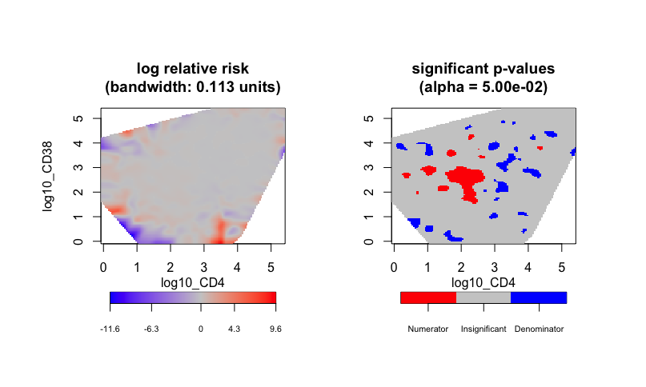
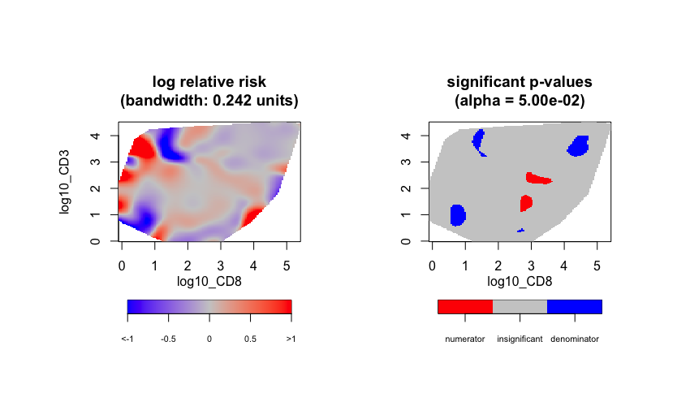
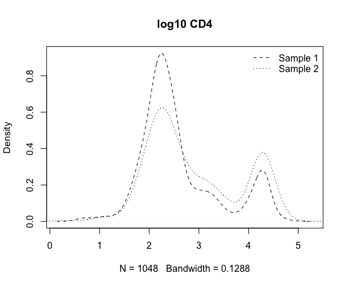

gateR: Flow/Mass Cytometry Gating via Spatial Kernel Density Estimation 
===================================================

<h2 id="overview">

Overview

</h2>

The `gateR` package is a suite of `R` functions to identify significant spatial clustering of flow and mass cytometry data used in immunological investigations. For a two-group comparison we detect clusters using the kernel-based spatial relative risk function that is estimated using the [sparr](https://CRAN.R-project.org/package=sparr) package. The tests are conducted in two-dimensional space comprised of two fluorescent markers. 

Examples of a single condition with two groups:

1. Disease case v. healthy control
2. Time 2 v. Time 1 (baseline)

For a two-group comparison of two conditions we estimate two relative risk surfaces for one condition and then a ratio of the relative risks. For example:

1. Estimate a relative risk surface for:
    1. Condition 2B v. Condition 2A
    2. Condition 1B v. Condition 1A
2. Estimate relative risk surface for the ratio:


Within areas where the relative risk exceeds an asymptotic normal assumption, the `gateR` package has functionality to examine the features of these cells. Basic visualization is also supported. 

<h2 id="install">

Installation

</h2>

To install the release version from CRAN:

    install.packages("gateR")

To install the development version from GitHub:

    devtools::install_github("Waller-SUSAN/gateR")

<h2 id="available-functions">

Available functions

</h2>

<table>
<colgroup>
<col width="30%" />
<col width="70%" />
</colgroup>
<thead>
<tr class="header">
<th>Function</th>
<th>Description</th>
</tr>
</thead>
<tbody>
<td><code>gating</code></td>
<td>Main function. Conduct a gating strategy for flow and mass cytometry data.</td>
</tr>
<td><code>rrs</code></td>
<td>Called within <code>gating</code>, one condition comparison.</td>
</tr>
<td><code>lotrrs</code></td>
<td>Called within <code>gating</code>, two condition comparison. </td>
</tr>
<td><code>pval_correct</code></td>
<td>Called within <code>rrs</code> and <code>lotrrs</code>, calculates a Bonferroni corrected alpha level that accounts for the spatial correlation of a relative risk surface.</td>
</tr>
<td><code>lrr_plot</code></td>
<td>Called within <code>rrs</code> and <code>lotrrs</code>, provides functionality for basic visualization of a log relative risk surface.</td>
</tr>
<td><code>pval_plot</code></td>
<td>Called within <code>rrs</code> and <code>lotrrs</code>, provides functionality for basic visualization of a significant p-value surface.</td>
</tr>
</tbody>
<table>

<h2 id="available-data">

Available sample data sets

</h2>

<table>
<colgroup>
<col width="30%" />
<col width="70%" />
</colgroup>
<thead>
<tr class="header">
<th>Function</th>
<th>Description</th>
</tr>
</thead>
<tbody>
<td><code>randCyto</code></td>
<td>A sample dataset containing information about flow cytometry data with two binary conditions and four markers. The data are a random subset of the 'extdata' data in the <a href="https://bioconductor.org/packages/release/data/experiment/html/flowWorkspaceData.html">flowWorkspaceData</a> package found on <a href="https://bioconductor.org">Bioconductor</a> and formated for `gateR` input.</td>
</tr>
</tbody>
<table>

<h2 id="authors">

Authors

</h2>

* **Ian D. Buller** - *Occupational and Environmental Epidemiology Branch, Division of Cancer Epidemiology and Genetics, National Cancer Institute, National Institutes of Health, Rockville, Maryland* - [GitHub](https://github.com/idblr)

See also the list of [contributors](https://github.com/Waller-SUSAN/gateR/graphs/contributors) who participated in this project. Main contributors include:

* **Elena Hsieh** - *Immunology & Microbiology and Pediatrics, University of Colorado Anschutz School of Medicine* - [GitHub](https://github.com/elenahsieh1407)
* **Debashis Ghosh** - *Biostatistics & Informatics, Colorado School of Public Health, Aurora, Colorado* - [GitHub](https://github.com/ghoshd)
* **Lance A. Waller** - *Biostatistics and Bioinformatics, Emory University, Atlanta, Georgia* - [GitHub](https://github.com/lance-waller)

## Usage
``` r
set.seed(1234) # for reproducibility

# ------------------ #
# Necessary packages #
# ------------------ #

library(gateR)
library(dplyr)
library(flowWorkspaceData)
library(ncdfFlow)
library(stats)

# ---------------- #
# Data preparation #
# ---------------- #

# Use 'extdata' from the {flowWorkspaceData} package
flowDataPath <- system.file("extdata", package = "flowWorkspaceData")
fcsFiles <- list.files(pattern = "CytoTrol", flowDataPath, full = TRUE)
ncfs  <- ncdfFlow::read.ncdfFlowSet(fcsFiles)
fr1 <- ncfs[[1]]
fr2 <- ncfs[[2]]

## Comparison of two samples (single condition) "g1"
## Two gates (four markers) "CD4", "CD38", "CD8", and "CD3"
## Arcsinh Transformation for all markers
## Remove cells with NA and Inf values

# First sample
obs_dat1 <- data.frame("id" = seq(1, nrow(fr1@exprs), 1),
                       "g1" = rep(1, nrow(fr1@exprs)),
                       "arcsinh_CD4" = asinh(fr1@exprs[ , 5]),
                       "arcsinh_CD38" = asinh(fr1@exprs[ , 6]),
                       "arcsinh_CD8" = asinh(fr1@exprs[ , 7]),
                       "arcsinh_CD3" = asinh(fr1@exprs[ , 8]))
# Second sample
obs_dat2 <- data.frame("id" = seq(1, nrow(fr2@exprs), 1),
                       "g1" = rep(2, nrow(fr2@exprs)),
                       "arcsinh_CD4" = asinh(fr2@exprs[ , 5]),
                       "arcsinh_CD38" = asinh(fr2@exprs[ , 6]),
                       "arcsinh_CD8" = asinh(fr2@exprs[ , 7]),
                       "arcsinh_CD3" = asinh(fr2@exprs[ , 8]))
                       
# Full set
obs_dat <- rbind(obs_dat1, obs_dat2)
obs_dat <- obs_dat[complete.cases(obs_dat), ] # remove NAs
obs_dat <- obs_dat[is.finite(rowSums(obs_dat)), ] # remove Infs
obs_dat$g1 <- as.factor(obs_dat$g1) # set "g1" as binary factor

## Create a second condition (randomly split the data)
## In practice, use data with a measured second condition
g2 <- stats::rbinom(nrow(obs_dat), 1, 0.5)
obs_dat$g2 <- as.factor(g2)
obs_dat <- obs_dat[ , c(1:2,7,3:6)]

# Export 'randCyto' data for CRAN examples
randCyto <- dplyr::sample_frac(obs_dat, size = 0.1) # random subsample

# ---------------------------- #
# Run gateR with one condition #
# ---------------------------- #

# Single condition
## A p-value uncorrected for multiple testing
test_gating <- gateR::gating(dat = obs_dat,
                             vars = c("arcsinh_CD4", "arcsinh_CD38",
                                      "arcsinh_CD8", "arcsinh_CD3"),
                             n_condition = 1,
                             doplot = TRUE,
                             upper_lrr = 1,
                             lower_lrr = -1)

# -------------------- #
# Post-gate assessment #
# -------------------- #

# Density of arcsinh-transformed CD4 post-gating
graphics::plot(stats::density(test_gating$obs[test_gating$obs$g1 == 1, 4]),
               main = "arcsinh CD4",
               lty = 2)
graphics::lines(stats::density(test_gating$obs[test_gating$obs$g1 == 2, 4]),
                lty = 3)
graphics::legend("topright",
                 legend = c("Sample 1", "Sample 2"),
                 lty = c(2, 3),
                 bty = "n")
```







```r
# ----------------------------- #
# Run gateR with two conditions #
# ----------------------------- #

## A p-value uncorrected for multiple testing
test_gating2 <- gateR::gating(dat = obs_dat,
                              vars = c("arcsinh_CD4", "arcsinh_CD38",
                                       "arcsinh_CD8", "arcsinh_CD3"),
                              n_condition = 2)

# --------------------------------------------- #
# Perform a single gate without data extraction #
# --------------------------------------------- #

# Single condition
## A p-value uncorrected for multiple testing
## For "arcsinh_CD4" and "arcsinh_CD38"
test_rrs <- gateR::rrs(dat = obs_dat[ , -7:-6])

# Two conditions
## A p-value uncorrected for multiple testing
## For "arcsinh_CD8" and "arcsinh_CD3"
test_lotrrs <- gateR::lotrrs(dat = obs_dat[ , -5:-4])
```
